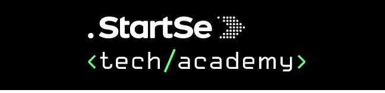

    

 

- [Modulo I - Introdução, Sistemas e Aplicações](/docs/modulo-01)
  - O que é programar?
  - Hardware
  - Software
  - Estrutura de um computador
  - Internet
  - Sistemas Operacionais
  - Tipos de aplicação Web

- [Modulo II - Linguagens de Programação](/docs/modulo-02)
    - Linguagens de Programação
    - Configuração de Ferramentas
    - Lógica de Programação

- [Modulo III - Aprendendo HTML e Elementos](/docs/modulo-03)
    - HTML
    - Elementos Semânticos
    - Header
    - Links
    - Formatando Tabelas

- [Modulo IV - Aprendendo CSS](/docs/modulo-04)
    - CSS
    - Unidades de medida e valor
    - Box Model
    - Cores e Background
    - Áudio e vídeo

- [Modulo V - Elementos de Página](/docs/modulo-05)
    - Layouts
    - Fontes e textos
    - Forms
