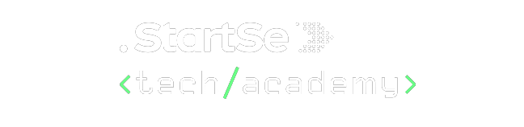

    

 

- [Modulo I - Introdução, Sistemas e Aplicações](/docs/modulo-01)
  - O que é programar?
  - Hardware
  - Software
  - Estrutura de um computador
  - Internet
  - Sistemas Operacionais
  - Tipos de aplicação Web

- [Modulo II - Linguagens de Programação](/docs/modulo-02)
    - Linguagens de Programação
    - Configuração de Ferramentas
    - Lógica de Programação

- [Modulo III - Aprendendo HTML e Elementos](/docs/modulo-03)
    - HTML
    - Elementos Semânticos
    - Header
    - Links
    - Formatando Tabelas

- [Modulo IV - Aprendendo CSS](/docs/modulo-04)
    - CSS
    - Unidades de medida e valor
    - Box Model
    - Cores e Background
    - Áudio e vídeo

- [Modulo V - Elementos de Página](/docs/modulo-05)
    - Layouts
    - Fontes e textos
    - Forms

- [Modulo VI - Introdução ao GIT](/docs/modulo-06)
    - Introdução
    - Configuração de ambiente
    - GitHub - GitLab - Bitbucket
    - Init
    - Clone
    - Commit
    - Add
    - Push
    - Pull
    - Reset
    - Stash
    - Diff
    - Pull requests
    - Gitflow

- Modulo VII - Javascript
    - O que é JavaScript
    - Tipos de dados
    - Variáveis
    - Conhecendo as variáveis
    - Tipos dinâmicos
    - Scope, var let e const
    - Nomeando variáveis
    - Agrupando declarações
    - Objects
    - Arrays
    - Operadores
    - Condicionais
    - Manipulando dados
    - Expressões e Operadores
    - Operador Ternário
    - Condicionais e controle de fluxo
    - Estruturas de repetição

- [Modulo V - HTML Semântico e FlexBox](/docs/modulo-08)
    - HTML Semântico
    - Seletores
    - FlexBox
    - Grid
    - Bootstrap
